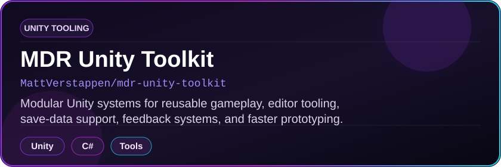
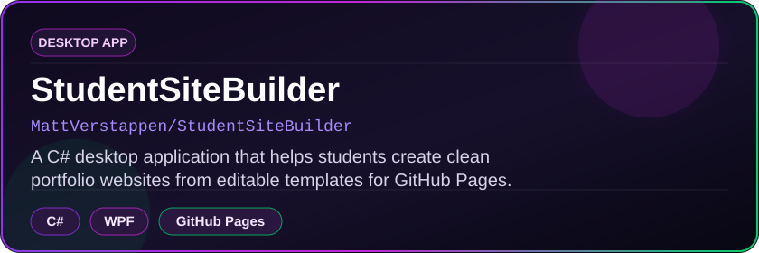
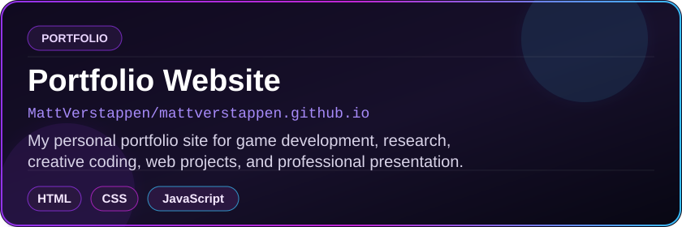
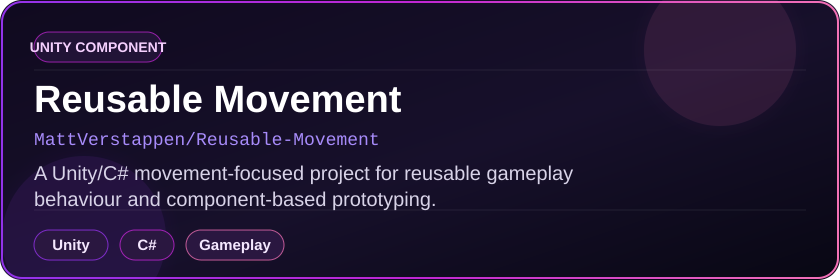

  

  

  Also known as Matt Verstappen - building polished interactive worlds, gameplay systems, and creative technical projects.

 

  

 

  
  
  

 

  

 

  

<!-- INTRODUCTION -->

  

 

<table align="center" width="100%" cellpadding="18" cellspacing="0">
  <tr>
    <td align="left" valign="top">
      

        I'm <strong>Matthew Derek Rall</strong>, a Unity-focused <strong>game developer and designer</strong> working across gameplay systems, interactive prototypes, game feel, UI/UX, and creative technical production.
      

      

        My work sits between design and implementation: I enjoy taking an idea from early concept through playable systems, user-facing polish, and portfolio-ready presentation. I am currently building out my portfolio and personal projects while looking for opportunities where I can contribute as a creative, technical, and reliable developer.
      

      

        I am open to <strong>game development</strong>, <strong>interactive design</strong>, <strong>UI/UX</strong>, <strong>remote</strong>, <strong>international</strong>, and <strong>USA-based</strong> opportunities.
      

    </td>
  </tr>
</table>

 

<table align="center" width="100%" cellpadding="14" cellspacing="0">
  <tr>
    <td align="center" valign="top" width="33.33%">
      <strong>Game Development</strong>
       
      Unity, C#, gameplay systems, prototypes, interaction design
    </td>
    <td align="center" valign="top" width="33.33%">
      <strong>Design Thinking</strong>
       
      Game design, UI/UX, player experience, visual identity
    </td>
    <td align="center" valign="top" width="33.33%">
      <strong>Research Mindset</strong>
       
      Honours research, VR education, reflective design practice
    </td>
  </tr>
</table>

 

<!-- CURRENT FOCUS -->

  

 

<table align="center" width="100%" cellpadding="14" cellspacing="0">
  <tr>
    <td align="left" valign="top" width="50%">
      <strong>Currently building</strong>
        
      - Showcase2025, a Unity game development showcase project 
      - Portfolio v2 for <a href="https://matthewderekrall.com">matthewderekrall.com</a> 
      - A Unity reusable assets library for faster prototyping
    </td>
    <td align="left" valign="top" width="50%">
      <strong>Looking for</strong>
        
      - Game developer / game designer roles 
      - Interactive design and UI/UX opportunities 
      - Remote, international, USA-based, contract, or studio work
    </td>
  </tr>
</table>

 

  
  

 

  

<!-- FEATURED PROJECTS -->

  

 

<table align="center" width="100%" cellpadding="14" cellspacing="0">
  <tr>
    <td align="left" valign="top" width="50%">
      
       
      <strong><a href="https://github.com/MattVerstappen/mdr-unity-toolkit">mdr-unity-toolkit</a></strong>
       
      A focused Unity toolkit for reusable game-development systems, editor workflow support, and faster iteration.
    </td>
    <td align="left" valign="top" width="50%">
      
       
      <strong><a href="https://github.com/MattVerstappen/StudentSiteBuilder">StudentSiteBuilder</a></strong>
       
      A larger C# desktop application for building student portfolio sites with a practical packaged workflow.
    </td>
  </tr>
  <tr>
    <td align="left" valign="top" width="50%">
      
       
      <strong><a href="https://github.com/MattVerstappen/mattverstappen.github.io">mattverstappen.github.io</a></strong>
       
      The live portfolio website repository for presenting game development, research, and creative technical work.
    </td>
    <td align="left" valign="top" width="50%">
      
       
      <strong><a href="https://github.com/MattVerstappen/Reusable-Movement">Reusable-Movement</a></strong>
       
      A supporting Unity/C# movement component project built around reusable gameplay behaviour.
    </td>
  </tr>
</table>

 

 

 

  

 

  

<!-- TECH STACK -->

  

<table align="center" width="100%" cellpadding="14" cellspacing="0">
  <tr>
    <td align="center" width="50%" valign="top">
      
        
      
        
      Unity, C#, Unreal, Blender, gameplay systems, prototyping, game design, UI/UX
    </td>
    <td align="center" width="50%" valign="top">
      
        
      
        
      Frontend development, backend/data basics, web tooling, portfolio sites, creative technical builds
    </td>
  </tr>
  <tr>
    <td align="center" colspan="2" valign="top">
      
        
      
    </td>
  </tr>
</table>

 

  

 

  

<!-- RESEARCH AND EDUCATION -->

  

<table align="center" width="100%" cellpadding="16" cellspacing="0">
  <tr>
    <td align="left" valign="top">
      <strong>Bachelor of Information Science in Game Design and Game Development</strong>
       
      NQF Level 7 - Emeris Vega
       
      Focus areas: game design, Unity, C#, Blender, Photoshop, interactive media production
    </td>
  </tr>
  <tr>
    <td align="left" valign="top">
      <strong>Bachelor of Arts Honours in Design Leadership</strong>
       
      NQF Level 8 - Emeris Vega
        
      <strong>Published honours research:</strong>
      <em>Exploring Virtual Reality in Game Development Education: Student Perspectives on Learning</em>
        
      
    </td>
  </tr>
</table>

 

  

<!-- GITHUB STATS -->

  

<table align="center" width="100%" cellpadding="14" cellspacing="0">
  <tr>
    <td align="center">
      
      
    </td>
  </tr>
  <tr>
    <td align="center">
      
    </td>
  </tr>
</table>

 

  

 

  

 

  

<!-- PERSONAL NOTES -->

  

 

  
  

 

  
<strong>Anime inspirations and favourite characters</strong>

   
  <table align="center" width="100%" cellpadding="8" cellspacing="0">
    <tr>
      <td align="center" colspan="3">
        <strong>Top anime</strong>
      </td>
    </tr>
    <tr>
      <td align="center" width="33.33%" valign="top">
        
         
        That Time I Got Reincarnated As A Slime
      </td>
      <td align="center" width="33.33%" valign="top">
        
         
        Welcome To The Demon School Iruma-kun
      </td>
      <td align="center" width="33.33%" valign="top">
        
         
        Mashle: Magic And Muscles
      </td>
    </tr>
    <tr>
      <td align="center" colspan="3">
        <strong>Favourite characters</strong>
      </td>
    </tr>
    <tr>
      <td align="center" width="33.33%" valign="top">
        
         
        Rimuru Tempest
      </td>
      <td align="center" width="33.33%" valign="top">
        
         
        Asta
      </td>
      <td align="center" width="33.33%" valign="top">
        
         
        Monkey D. Luffy
      </td>
    </tr>
  </table>

 

<!-- SETUP -->

  
<strong>Development setup</strong>

   
  <table align="center" width="100%" cellpadding="12" cellspacing="0">
    <tr>
      <td align="left" valign="top" width="50%">
        <strong>PC specs</strong>
          
        <table align="center" width="100%" cellpadding="6" cellspacing="0">
          <tr><td><strong>Motherboard</strong></td><td>MPG X870E EDGE TI WIFI</td></tr>
          <tr><td><strong>CPU</strong></td><td>AMD Ryzen 9 9950X3D - 16-Core - 32 Threads - 4300 MHz</td></tr>
          <tr><td><strong>GPU</strong></td><td>NVIDIA GeForce RTX 5070 Ti - 16 GB</td></tr>
          <tr><td><strong>RAM</strong></td><td>32 GB DDR5 Kingston Fury Beast - 6000 MT/s</td></tr>
          <tr><td><strong>Storage</strong></td><td>WD Black SN850X - 1 TB NVMe M.2 - 7300/6600 MB/s</td></tr>
          <tr><td><strong>PSU</strong></td><td>Corsair RM1000e</td></tr>
          <tr><td><strong>Cooling</strong></td><td>Nautilus 360 RS LCD</td></tr>
          <tr><td><strong>Case</strong></td><td>Corsair Frame 4000 Series</td></tr>
        </table>
      </td>
      <td align="left" valign="top" width="50%">
        <strong>Peripherals</strong>
          
        <table align="center" width="100%" cellpadding="6" cellspacing="0">
          <tr><td><strong>Monitor</strong></td><td>Samsung Odyssey G5 - 32" - 165 Hz</td></tr>
          <tr><td><strong>Keyboard</strong></td><td>Corsair K95 Platinum XT</td></tr>
          <tr><td><strong>Mouse</strong></td><td>Corsair M65 Pro</td></tr>
          <tr><td><strong>Mouse Pad</strong></td><td>Glorious XXXL</td></tr>
          <tr><td><strong>Headset</strong></td><td>Corsair Virtuoso SE Wireless</td></tr>
          <tr><td><strong>Mic</strong></td><td>Music DJ M-800 Condenser</td></tr>
        </table>
      </td>
    </tr>
  </table>

 

  

<!-- CONTACT -->

  

 

  

    Interested in game development, interactive design, UI/UX, remote work, or international opportunities?
     
    Explore my portfolio or reach out about opportunities and collaborations.
  

  
  
  
  
  

 

  

