

  

  

  Neon-powered creator building immersive game experiences and futuristic interfaces.

 

  

  
  
  

  
  
  
  

 

  
  
  
  
  

  

 

  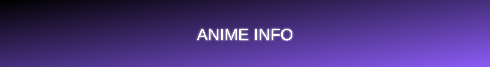

<!-- Top 3 Anime: single fixed 3-column table so title always matches middle poster -->
<table align="center" width="100%" cellpadding="10" cellspacing="0" style="max-width:1100px;border:1px solid #8b5cf6;background:#06030b;table-layout:fixed;">
  <tr>
    <td align="center" width="33.33%" valign="top"></td>
    <td align="center" width="33.33%" valign="top">
      
    </td>
    <td align="center" width="33.33%" valign="top"></td>
  </tr>
  <tr>
    <td align="center" width="33.33%" valign="top">
      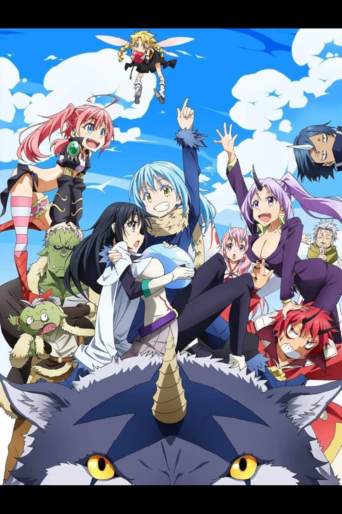
       
      
    </td>
    <td align="center" width="33.33%" valign="top">
      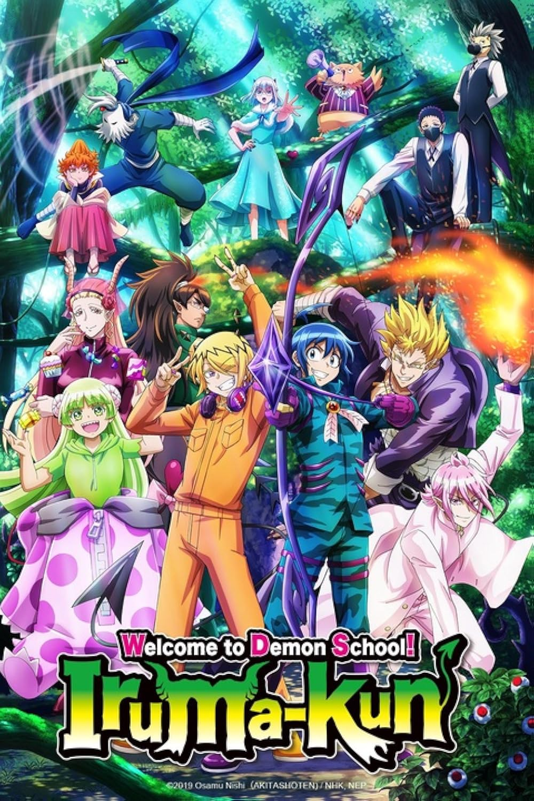
       
      
    </td>
    <td align="center" width="33.33%" valign="top">
      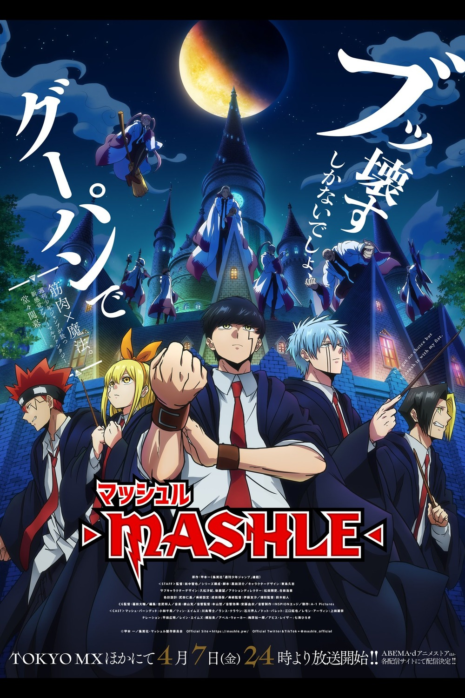
       
      
    </td>
  </tr>
</table>

<!-- Top 3 Characters: single fixed 3-column table so title always matches middle poster -->
<table align="center" width="100%" cellpadding="10" cellspacing="0" style="max-width:1100px;border:1px solid #8b5cf6;background:#06030b;table-layout:fixed;">
  <tr>
    <td align="center" width="33.33%" valign="top"></td>
    <td align="center" width="33.33%" valign="top">
      
    </td>
    <td align="center" width="33.33%" valign="top"></td>
  </tr>
  <tr>
    <td align="center" width="33.33%" valign="top">
      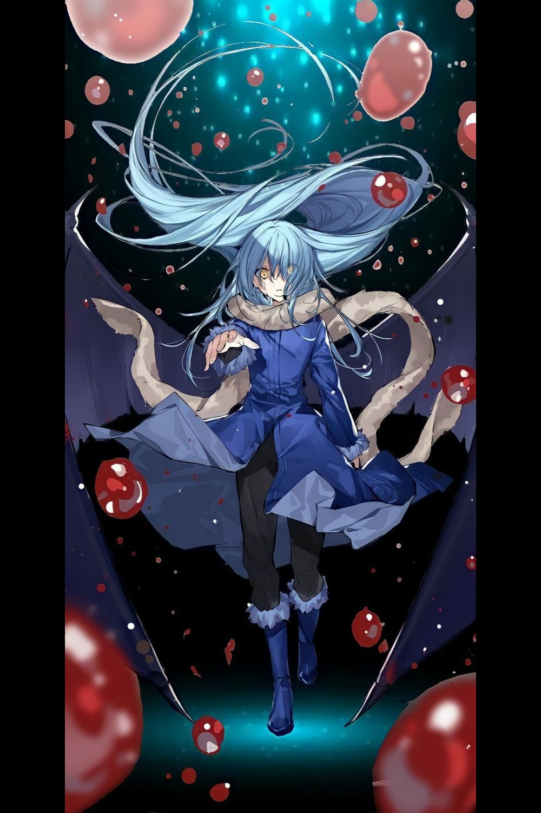
       
      
    </td>
    <td align="center" width="33.33%" valign="top">
      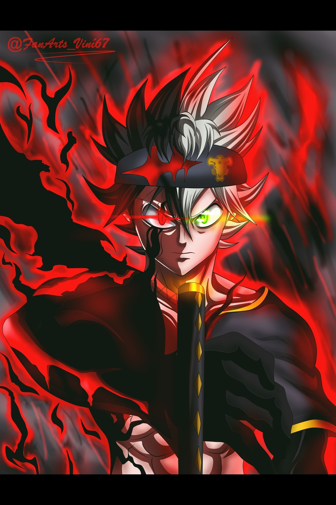
       
      
    </td>
    <td align="center" width="33.33%" valign="top">
      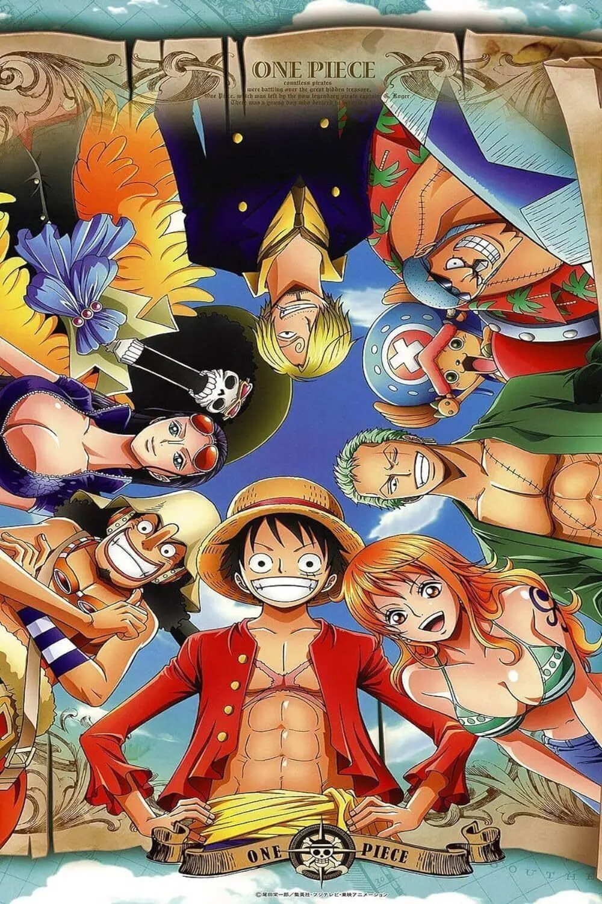
       
      
    </td>
  </tr>
</table>

 

  

 

  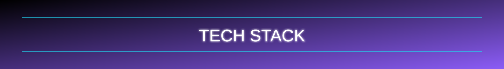

<table align="center" width="100%" cellpadding="14" cellspacing="0" style="max-width:1100px;border:1px solid #8b5cf6;background:#06030b;">
  <tr>
    <td align="center" width="50%" valign="top">
      
       
      
    </td>
    <td align="center" width="50%" valign="top">
      
       
      
    </td>
  </tr>
  <tr>
    <td align="center" width="50%" valign="top">
      
       
      
    </td>
    <td align="center" width="50%" valign="top">
      
       
      
    </td>
  </tr>
</table>

 

  

 

  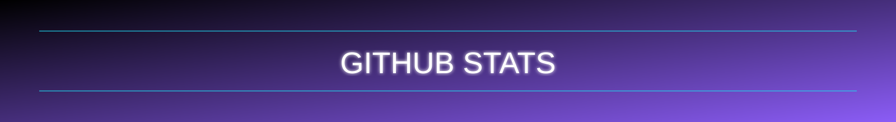

<table align="center" width="100%" cellpadding="14" cellspacing="0" style="max-width:1100px;border:1px solid #8b5cf6;background:#06030b;">
  <tr>
    <td align="center">
      
      
    </td>
  </tr>
  <tr>
    <td align="center">
      
    </td>
  </tr>
</table>

 

  

 

  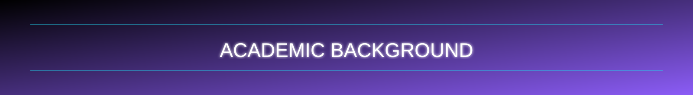

<table align="center" width="100%" cellpadding="16" cellspacing="0" style="max-width:1100px;border:1px solid #8b5cf6;background:#06030b;">
  <tr>
    <td align="left" valign="top">
      
       
      <strong>Bachelor of Information Science in Game Design and Game Development</strong>
       
      NQF Level: 7
       
      Institution: Emeris Vega
       
      Focus: Game Design and Development, Unity, C#, Blender, Photoshop
    </td>
  </tr>
  <tr>
    <td align="left" valign="top">
      
       
      <strong>Bachelor of Arts Honours in Design Leadership</strong>
       
      NQF Level: 8
       
      Institution: Emeris Vega
       
      Thesis: Exploring Virtual Reality in Game Development Education: Student Perspectives on Learning
       
      DOI: https://doi.org/10.13140/RG.2.2.32898.95688
    </td>
  </tr>
</table>

 

  

 

  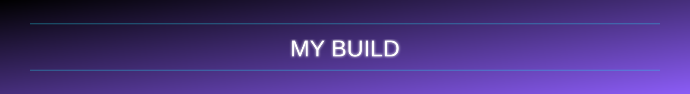

<!--
<table align="center" width="100%" cellpadding="12" cellspacing="0" style="max-width:1100px;border:1px solid #8b5cf6;background:#06030b;">
  <tr>
    <td align="center" width="50%" valign="top">
      
       
      [Main monitor + workstation]
    </td>
    <td align="center" width="50%" valign="top">
      
       
      [Peripheral setup]
    </td>
  </tr>
  <tr>
    <td align="center" width="50%" valign="top">
      
       
      [Dev and gaming desk angle]
    </td>
    <td align="center" width="50%" valign="top">
      
       
      [Lighting and ambiance]
    </td>
  </tr>
</table>
-->

<table align="center" width="100%" cellpadding="12" cellspacing="0" style="max-width:1100px;border:1px solid #22d3ee;background:#04060a;">
  <tr>
    <td align="left" valign="top" width="50%">
      
        
      <table align="center" width="100%" cellpadding="6" cellspacing="0">
        <tr><td><strong>Motherboard</strong></td><td>MPG X870E EDGE TI WIFI</td></tr>
        <tr><td><strong>CPU</strong></td><td>AMD Ryzen 9 9950X3D 16-Core Processor, 4300 MHz, 16 Cores, 32 Logical Processors</td></tr>
        <tr><td><strong>GPU</strong></td><td>NVIDIA GeForce RTX 5070 Ti - 16 GB</td></tr>
        <tr><td><strong>RAM</strong></td><td>32GB DDR5 Kingston Fury Beast 6000MT/s</td></tr>
        <tr><td><strong>Storage</strong></td><td>WD Black SN850X SSD, 1TB, NVMe, Heatsink, M.2 2280 PCIe Gen4x4, Read 7300 MB/s, Write 6600 MB/s</td></tr>
        <tr><td><strong>PSU</strong></td><td>Corsair RM1000e</td></tr>
        <tr><td><strong>Cooling</strong></td><td>Nautilus 360 RS LCD</td></tr>
        <tr><td><strong>Case</strong></td><td>Corsair Frame 4000 Series</td></tr>
      </table>
    </td>
    <td align="left" valign="top" width="50%">
      
        
      <table align="center" width="100%" cellpadding="6" cellspacing="0">
        <tr><td><strong>Monitor 1</strong></td><td>Samsung Odyssey G5 32 inch 165Hz</td></tr>
        <tr><td><strong>Monitor 2</strong></td><td>[Add Monitor]</td></tr>
        <tr><td><strong>Keyboard</strong></td><td>Corsair K95 Platinum XT</td></tr>
        <tr><td><strong>Mouse</strong></td><td>Corsair M65 Pro</td></tr>
        <tr><td><strong>Mouse Pad</strong></td><td>Glorious XXXL Mouse Pad</td></tr>
        <tr><td><strong>Headset</strong></td><td>CORSAIR VIRTUOSO SE Wireless Gaming Headset</td></tr>
        <tr><td><strong>Mic</strong></td><td>Music DJ M-800 Condenser Microphone</td></tr>
        <tr><td><strong>Speakers</strong></td><td>[Add Speakers]</td></tr>
        <tr><td><strong>Controller</strong></td><td>[Add Controller]</td></tr>
      </table>
    </td>
  </tr>
</table>

 

  

  

